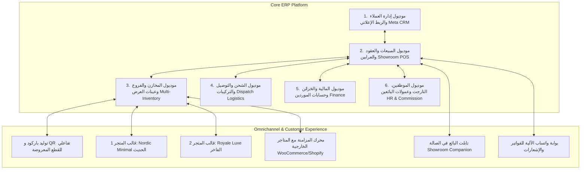

# وثيقة التصميم المعماري والتجاري الشامل للمنظومة
# System Design & Architecture Blueprint: DecorSync / FurniFlow Ecosystem

> **الإصدار:** 1.0.0  
> **التاريخ:** سبتمبر 2026  
> **طبيعة النظام:** منظومة سحابية متكاملة مخصصة لمعارض وشركات الأثاث والديكور والإضاءة (شغل جاهز / Multi-Branch Omnichannel ERP & CRM).  
> **المرجع الدائم:** هذه الوثيقة هي المرجع الهندسي، الوظيفي، والتصميمي لجميع مراحل بناء وتطوير النظام.

---

## 1. الرؤية التجارية ونموذج العمل (Business & Market Strategy)

### 1.1 الجمهور المستهدف (Target Market)
* معارض وصالات عرض الأثاث المودرن والكلاسيك (الشغل الجاهز).
* معارض الديكور، الإضاءة والتحف، والمفروشات الفاخرة.
* سلاسل المعارض من فرع واحد حتى 10 فروع مع مستودعات مركزية وأسطول شحن داخلي.

### 1.2 الميزة التنافسية الكبرى (The Unfair Advantage)
* حل مشكلة **الربط بين إعلانات Meta ومبيعات الصالة الفعلية** (معرفة أي حملة إعلانية حققت مبيعات كاش في المعرض وحساب الـ ROAS الدقيق).
* معالجة دورة حياة بيع الأثاث الحقيقية: **(عربون ⬅️ تجهيز ⬅️ جدولة شحن ⬅️ تركيب ⬅️ تحصيل البواقي مع السائق)**.
* التمييز الفوري بين **"القطعة المعروضة بالصالة Floor Sample"** و **"مخزون المستودع Warehouse Stock"**.

### 1.3 خطة الإطلاق والتسعير (Launch & Pricing Matrix)

```
┌────────────────────────────────────────────────────────────────────────┐
│                        الهيكل التسعيري الهجين                          │
│                                                                        │
│ 1. رسوم تأسيس وتدريب لمرة واحدة (Setup Fee):                           │
│    - Silver (فرع واحد): 25,000 - 35,000 ج                              │
│    - Gold (2-3 فروع + المتجر + Meta CRM): 45,000 - 60,000 ج            │
│    - Platinum (سلاسل كبرى وفروع متعددة): 80,000 - 120,000 ج+           │
│                                                                        │
│ 2. اشتراك سنوي سحابي وتحديثات ودعم (Annual Cloud & Support):           │
│    - يتراوح بين 10,000 إلى 25,000 ج سنوياً لكل معرض                   │
│                                                                        │
│ 3. التخصيصات والإضافات المدفوعة (Add-ons):                              │
│    - فروع إضافية، تعديلات مخصصة، شحنات رسائل واتساب، وبوابات التقسيط.  │
└────────────────────────────────────────────────────────────────────────┘
```

---

## 2. فلسفة ومعايير تجربة وواجهة المستخدم (UI / UX Design Standard)

> **المبدأ الأساسي:** وضوح هندسي هادئ، بدون بهرجة مشتتة، أزرار واضحة، خطوات متتابعة، وتدريب لا يتجاوز 15 دقيقة لأي موظف.

### 2.1 لوحة الألوان والطباعة (Palette & Typography)
* **الخلفيات:** Slate-50 / Cool Neutral Off-White للمساحات الواسعة والمريحة للعين.
* **اللون الأساسي الهادئ (Primary Brand):** Deep Slate Indigo `#1E293B` أو Forest Emerald `#0F3A2E` مع لمسات دافئة راقية (Muted Amber/Gold).
* **ألوان الإشارات والحالات (Semantic Indicators):**
  * `🟢 أخضر`: تم التسليم / مدفوع بالكامل / مكتمل.
  * `🟠 برتقالي`: عربون مدفوع / متبقي حساب / معلق.
  * `🔵 أزرق`: زيارة مجدولة / جاري الشحن والتجهيز.
  * `🔴 أحمر`: متأخر عن موعد التسليم / ملغي / مرتجع.
* **الخط المعتمد:** خط عربي رقمي عالي المقروئية (Cairo / IBM Plex Sans Arabic).

### 2.2 القواعد الصارمة للـ UI/UX
1. **قاعدة الـ 3 نقرات (3-Click Rule):** الوصول لأي شاشة أو فاتورة أو تقرير في أقل من 3 ضغطات.
2. **شريط البحث الشامل (Global Command - `Ctrl + K`):** بحث لحظي عن: عميل بالاسم أو الهاتف، رقم عقد، كود صنف، أو شحنة سائق.
3. **الجداول الذكية الصريحة (Smart Data Tables):**
   * هيدر ثابت (Sticky Header).
   * فلترة سريعة بالحالة والفرع والتاريخ.
   * أزرار أكشن واضحة ومباشرة: `[ 📄 عقد ]` | `[ 💬 واتساب ]` | `[ 🚚 شحن ]` | `[ 💵 تحصيل ]`.
4. **معالج العقود المتتابع (5-Step Sequential Sales Wizard):**
   * **خطوة 1:** بيانات العميل (بحث سريع بالهاتف).
   * **خطوة 2:** اختيار القطع، الألوان، الخامات، وحالة المخزون (صالة/مستودع).
   * **خطوة 3:** الحساب المالي (الإجمالي - الخصم - العربون المدفوع = المتبقي المحسوب تلقائياً).
   * **خطوة 4:** تفاصيل الشحن والتركيب (تاريخ الاستلام، العنوان، الحاجة لفني تركيب).
   * **خطوة 5:** تأكيد وحفظ ⬅️ إصدار العقد PDF فوراً + رسالة واتساب للعميل.

---

## 3. موديولات المنظومة التفصيلية (Ecosystem Modules)



---

### الموديول 1: إدارة العملاء والربط الإعلاني (Meta & Marketing Intelligence CRM)
* **سحب الليدز الفوري (Instant Lead Ads Webhook):** التقاط العملاء من نماذج فيسبوك وإنستجرام خلال ثوانٍ.
* **لوحة تحليلات الـ ROI والإعلانات:**
  * المصروف الإعلاني الفعلي لكل حملة (سحب آلي من Meta Graph API).
  * تكلفة الليد (CPL) وتكلفة زيارة المعرض (Cost Per Showroom Visit).
  * المبيعات المحققة فعلياً والعائد على الإنفاق (ROAS).
* **مسار المبيعات المرئي (Kanban Furniture Pipeline):**
  * `جديد من الإعلان` ⬅️ `تم التواصل وتأكيد الاحتياج` ⬅️ `حجز موعد زيارة` ⬅️ `زار المعرض` ⬅️ `عرض سعر` ⬅️ `دفع عربون وتعاقد` ⬅️ `تم التسليم والتصفية`.
* **ملف العميل الشامل (Customer 360):** تسجيل مقاسات الغرف، الألوان المفضلة، صور شقة العميل، وسجل تعاملاته المالية السابقة.

---

### الموديول 2: المبيعات والعقود ونقاط البيع (Showroom POS & Contracts)
* **إدارة العرابين والبواقي:** دعم الدفع المجزأ (دفعة أولى 30%، دفعة تجهيز، وباقي الحساب 70% عند التسليم).
* **إصدار وطباعة العقود الرسمية:** عقد رسمي أنيق A4 يحتوي على مواصفات القطع، نوع الخشب والقماش، شروط التسليم، وجدول الدفعات.
* **وضع الصالة والتابلت (Showroom Companion):** تصفح سريع للكتالوج، فحص المخزون فوراً من الصالة، وإمكانية مسح QR المعلق على الصالون لعرض ألوانه البديلة ومقاساته.
* **صلاحيات الخصم:** تحديد الحد الأقصى للخصم المسموح لكل بائع دون الحاجة لإذن المدير في كل معاملة.

---

### الموديول 3: المخازن وعينات العرض والفروع (Multi-Branch & Inventory)
* **التمييز بين عينات الصالة ومخزون المستودع:**
  * `حالة القطعة`: (جديدة بالمخزن / عينة عرض بالفرع A / محجوزة بعربون للعميل فلان / قطعة تصفية / تالفة).
* **المتغيرات والأبعاد (Variants & Dimensions):** الارتفاع × العرض × العمق، ونوع القماش، واللون، ونوع الخشب.
* **التحويلات بين الفروع (Inter-Branch Transfers):** طلب نقل قطعة من فرع لآخر مع تتبع حالة الشحن الداخلي وتأكيد الاستلام.
* **طباعة كروت الـ QR والباركود:** طباعة كروت أنيقة لتعليقها على الأثاث في المعرض.

---

### الموديول 4: الشحن والتركيبات وحركة السيارات (Logistics & Installation)
* **جدول رحلات سيارات التوصيل:** توزيع الأوردرات جغرافياً على سيارات المعرض وسائقيها.
* **فنيو التركيب (Installation Crew):** تعيين فني تركيب (نجار / كهربائي نجف) مع كل شحنة تحتاج تجميعاً.
* **إذن تسليم السائق (Driver Run-Sheet):** ورقة تسليم توضح للعميل القطع المستلمة، وتوضح للسائق المبلغ المطلوب تحصيله عند الباب.
* **إغلاق عهدة السائق المالية:** توريد الكاش المحصل من السائق إلى خزينة المعرض بضغطة زر مع تسجيل أي ملاحظات تركيب أو خدوش.

---

### الموديول 5: المالية والخزائن والموردين (Finance & Payables)
* **تعدد الخزائن والحسابات:** (خزينة الفرع كاش، حسابات بنكية، محافظ إلكترونية، فودافون كاش، ماكينات فيزا POS).
* **حسابات الموردين ومصانع الأثاث:** تسجيل فواتير الشراء، فترات السماح، الدفعات المسددة، والشيكات المستحقة.
* **سجل المصروفات والإيرادات:** مصروفات الصيانة، إيجارات الفروع، الكهرباء، البوفيه، ومصروفات التسويق.
* **تقارير الأرباح والخسائر الصافية (P&L):** كشف ربحية كل فرع، وربحية كل صنف وكولكشن أثاث.

---

### الموديول 6: الموظفين وعمولات المبيعات (HR & Commissions)
* **حساب العمولات الآلي:** (نسبة ثابتة على المبيعات، أو عمولة تصاعدية حسب تحقيق التارجت، أو بونص مخصص لتصريف بضاعة راكدة).
* **سجل الموظفين والبائعين:** تسجيل بيانات المناديب، مواعيد العمل، والحوافز والخصومات.

---

### الموديول 7: المتاجر الإلكترونية الجاهزة (Showcase Websites & E-Commerce)
1. **القالب 1: "Nordic Minimal":** مخصص للأثاث المودرن، الإضاءة الحديثة، والديكورات العصرية البسيطة.
2. **القالب 2: "Royale Luxe":** مخصص للأثاث الكلاسيك، الصالونات الفاخرة، والإضاءة الكريستالية.
3. **المزامنة اللحظية (Omnichannel Sync):**
   * عند بيع آخر قطعة في المعرض، يُحدث المخزون أونلاين فوراً لمنع بيع صنف غير متوفر.
   * إمكانية تحويل الموقع إلى "كتالوج رقمي + زر طلب معاينة بالمعرض عبر واتساب" لمن لا يريد الدفع المباشر أونلاين.

---

## 4. البنية التقنية ومخطط قاعدة البيانات (Tech Stack & Database Schema)

### 4.1 حزمة التقنيات المقترحة (Tech Stack)
* **واجهة المستخدم والنظام (Fullstack Framework):** Next.js 15 (React 19) مع TypeScript و Tailwind CSS.
* **مكتبة المكونات والتصميم (UI Components):** Shadcn UI / Radix UI + Lucide Icons (تصميم نقي، احترافي وخالي من الفوضى).
* **قاعدة البيانات والـ ORM:** PostgreSQL / SQLite (للديمو المحلي) مع Prisma ORM.
* **إدارة الحالة والـ API:** React Server Actions / REST APIs مع Zod للتحقق من صحة المدخلات.
* **التكاملات الخارجية (External Integrations):** Meta Graph API (Lead Ads & CAPI) + WhatsApp Cloud API / Baileys Gateway.

---

### 4.2 مخطط الكيانات الرئيسي (Core Database Schema Entities)

```prisma
// 1. الفروع والمخازن (Branches & Warehouses)
model Branch {
  id          String      @id @default(cuid())
  name        String      // فرع التجمع، فرع أكتوبر، فرع دمياط
  code        String      @unique
  address     String?
  phone       String?
  isMain      Boolean     @default(false)
  warehouses  Warehouse[]
  users       User[]
  orders      Order[]
  vaults      Vault[]
  createdAt   DateTime    @default(now())
}

model Warehouse {
  id          String      @id @default(cuid())
  name        String      // مستودع العبور المركزي، مخزن الصالة
  branchId    String
  branch      Branch      @relation(fields: [branchId], references: [id])
  isFloorShow Boolean     @default(false) // هل هذا مخزن صالة العرض؟
  stocks      StockItem[]
}

// 2. المنتجات والأصناف (Products & Variants)
model Category {
  id          String      @id @default(cuid())
  name        String      // غرف نوم، صالونات، إضاءة، ترابيزات
  slug        String      @unique
  products    Product[]
}

model Product {
  id          String      @id @default(cuid())
  sku         String      @unique
  name        String      // صالون نيو كلاسيك لوتس
  categoryId  String
  category    Category    @relation(fields: [categoryId], references: [id])
  woodType    String?     // زان أحمر، سويد، إم دي إف
  dimensions  String?     // 220cm x 90cm x 85cm
  costPrice   Decimal     // سعر التكلفة
  retailPrice Decimal     // سعر البيع الأساسي
  minPrice    Decimal     // الحد الأدنى للسعر المسموح للبائع
  images      String[]    // روابط الصور عالية الجودة
  stocks      StockItem[]
  orderItems  OrderItem[]
}

model StockItem {
  id          String      @id @default(cuid())
  productId   String
  product     Product     @relation(fields: [productId], references: [id])
  warehouseId String
  warehouse   Warehouse   @relation(fields: [warehouseId], references: [id])
  fabricColor String?     // كشمير، رمادي بترولي
  status      String      @default("AVAILABLE") // AVAILABLE, FLOOR_DISPLAY, RESERVED, DAMAGED
  quantity    Int         @default(1)
  barcode     String?     @unique
}

// 3. إدارة العملاء والتسويق (CRM & Meta Integration)
model MarketingCampaign {
  id          String      @id @default(cuid())
  platform    String      // META, GOOGLE, TIKTOK, DIRECT
  campaignId  String?     // Meta Ad Campaign ID
  name        String      // حملة صالونات مودرن - سبتمبر
  adSpend     Decimal     @default(0) // المصروف الإعلاني
  leads       Lead[]
}

model Lead {
  id          String             @id @default(cuid())
  fullName    String
  phone       String
  city        String?
  source      String             // META_LEAD_FORM, WHATSAPP, WALK_IN
  status      String             @default("NEW") // NEW, CONTACTED, VISIT_SCHEDULED, VISITED, WON, LOST
  campaignId  String?
  campaign    MarketingCampaign? @relation(fields: [campaignId], references: [id])
  assignedToId String?
  assignedTo  User?              @relation(fields: [assignedToId], references: [id])
  notes       String?
  customer    Customer?
  createdAt   DateTime           @default(now())
}

model Customer {
  id          String      @id @default(cuid())
  leadId      String?     @unique
  lead        Lead?       @relation(fields: [leadId], references: [id])
  fullName    String
  phone       String      @unique
  secondaryPhone String?
  address     String?
  city        String?
  notes       String?     // أبعاد الريسبشن، ألوان الشقة
  orders      Order[]
  createdAt   DateTime    @default(now())
}

// 4. المبيعات، العقود، والعرابين (Sales Orders & Contracts)
model Order {
  id            String         @id @default(cuid())
  orderNumber   String         @unique // ORD-2026-001
  branchId      String
  branch        Branch         @relation(fields: [branchId], references: [id])
  customerId    String
  customer      Customer       @relation(fields: [customerId], references: [id])
  salesRepId    String
  salesRep      User           @relation("SalesRepOrders", fields: [salesRepId], references: [id])
  
  totalAmount   Decimal        // إجمالي الفاتورة
  discount      Decimal        @default(0)
  netAmount     Decimal        // الصافي بعد الخصم
  depositPaid   Decimal        @default(0) // العربون المدفوع
  remainingDue  Decimal        // المبلغ المتبقي عند التسليم
  
  status        String         @default("PENDING_DEPOSIT") // PENDING_DEPOSIT, BOOKED, READY_FOR_SHIP, DELIVERED, CANCELLED
  deliveryDate  DateTime?      // موعد التسليم المتفق عليه
  deliveryAddress String?
  needsAssembly Boolean        @default(true) // يحتاج فني تركيب
  
  items         OrderItem[]
  payments      Payment[]
  deliveryTask  DeliveryTask?
  createdAt     DateTime       @default(now())
}

model OrderItem {
  id          String      @id @default(cuid())
  orderId     String
  order       Order       @relation(fields: [orderId], references: [id])
  productId   String
  product     Product     @relation(fields: [productId], references: [id])
  fabricColor String?
  quantity    Int         @default(1)
  unitPrice   Decimal
  totalPrice  Decimal
  isFromFloor Boolean     @default(false) // تم البيع من عينة الصالة مباشرة
}

// 5. المدفوعات والخزائن (Payments & Vaults)
model Vault {
  id          String      @id @default(cuid())
  name        String      // خزينة فرع التجمع الرئيسية، فيزا مبيعات
  branchId    String
  branch      Branch      @relation(fields: [branchId], references: [id])
  balance     Decimal     @default(0)
  payments    Payment[]
}

model Payment {
  id          String      @id @default(cuid())
  orderId     String
  order       Order       @relation(fields: [orderId], references: [id])
  vaultId     String
  vault       Vault       @relation(fields: [vaultId], references: [id])
  amount      Decimal
  type        String      // DEPOSIT (عربون), INTERMEDIATE (دفعة وسطى), FINAL_COD (باقي عند الاستلام)
  method      String      // CASH, VISA, VODAFONE_CASH, BANK_TRANSFER, VALU
  receiptNumber String    @unique
  collectedById String
  collectedBy User        @relation(fields: [collectedById], references: [id])
  createdAt   DateTime    @default(now())
}

// 6. الشحن والتركيبات (Logistics & Delivery)
model DeliveryTask {
  id            String      @id @default(cuid())
  orderId       String      @unique
  order         Order       @relation(fields: [orderId], references: [id])
  driverName    String
  driverPhone   String
  technicianName String?    // فني التركيب
  scheduledDate DateTime
  status        String      @default("SCHEDULED") // SCHEDULED, ON_THE_WAY, DELIVERED_PAID, RETURNED
  collectedCash Decimal     @default(0) // الكاش المحصل مع السائق
  notes         String?
}

// 7. المستخدمين والعمولات (Users, HR & Commissions)
model User {
  id            String      @id @default(cuid())
  name          String
  email         String      @unique
  phone         String?
  role          String      // ADMIN, BRANCH_MANAGER, SALES_REP, ACCOUNTANT, LOGISTICS
  branchId      String?
  branch        Branch?     @relation(fields: [branchId], references: [id])
  commissionRate Decimal    @default(0) // نسبة العمولة المئوية
  ordersSold    Order[]     @relation("SalesRepOrders")
  paymentsCollected Payment[]
  leadsAssigned Lead[]
  createdAt     DateTime    @default(now())
}
```

---

## 5. خطة التنفيذ الميدانية (Next Implementation Milestones)

* **المرحلة 1:** بناء الهيكل الأساسي والمحرك المركزي (Next.js + Tailwind + Mock/SQLite Database).
* **المرحلة 2:** تطوير شاشة الـ CRM ومسار الـ Kanban مع لوحة تحليلات الـ Meta ROI المبهرة.
* **المرحلة 3:** تطوير معالج العقود المتتابع (5-Step Contract Wizard) وإدارة العرابين والبواقي.
* **المرحلة 4:** تطوير شاشات المخازن، عينات العرض (Floor Samples)، والـ QR Code Tags.
* **المرحلة 5:** تطوير واجهة الشحن وتسليمات السائقين مع تقفيل العهدة.
* **المرحلة 6:** بناء القالبين الجاهزين للمتجر وربطهما بالعرض التجريبي.

---
*(تم حفظ هذا الملف كمرجع دائم في جذر المشروع تحت اسم `SYSTEM_DESIGN.md` للرجوع إليه وتطبيقه خطوة بخطوة).*
